```{r setup, include=FALSE}
library(scales)
library(tidyverse)
library(lubridate)
library(wikipediatrend)

theme_set(theme_bw())

knitr::opts_chunk$set(echo = TRUE)
```

# 1. Introduction

This Rmd file attempts to replicate and extend the results in Chilling Effects: Online Surveillance and Wikipedia Use by Jonathon W. Penney in Berkeley Technology Law Journal. The author is a research fellow at University of Toronto. This single author paper has H5-index of 21. This paper is about the NSA/PRISM surveillance 2007, where United States National Security Agency (NSA) started collecting Internet communications from various US Internet companies. This information was made public in 2013 by Edward Snowden revelations. This paper deals with the NSA paranoia where the paper studies traffic to Wikipedia articles on topics that raise privacy concerns for Wikipedia users before and after the Edward Snowden revelations. The Wikipedia traffic was chosen because over 50% of Internet users use Wikipedia as a source of information. Over 1/3 of Americans annually access Wikipedia as a source of information and is in top 10 of most popular sites on the internet.

# 2. Reproducing the Original Study

Our group decide to reproduce the main analysis of the study which is the study about the discontinuity of the trend of views on Wikipedia articles. Although the data is time series, linear regression is a good way to capture the trend since our main goal is not predicting the exact number of views. The linear model used in the study is:

$$Y_t = \beta_0 + \beta_1 time + \beta_2 intervention + \beta_3 postslope$$

The model can be interpret as an ordinary regression for data at the time before the revelation of the surveilance in June 2013. For the data after the incident, an interaction is added to both intercept and slope, 0 if data is before and 1 for after. 'Intervention' or change in level is the binary value multiply with a weight which indicates the changing intercept after the event. 'Postslope' or change in slope is the binary value multiply with time indicating change in trend. 

## 2.1 Data

The study uses a list of keywords the U.S. Department of Homeland Security uses to track and monitor social media. Keyword selection and ranking are done using a survey on Amazon’s Mechanical Turk (MTurk) asking their opinions about topics on ‘Government trouble’, ‘Browser delete’, ‘Privacy sensitive’, ‘Avoidance’. Then all the scores are averaged to a single value called 'Combined privacy rating'. 

The paper uses data from stats.grok.se which has stopped being updated as of January 2016 and the server is down at the moment. Our group chose to use an alternative data source from Wikipediatrend package in R (https://github.com/petermeissner/wikipediatrend) which allows user to specify page names, languages, start and end date of data and the library will return daily views for the articles.

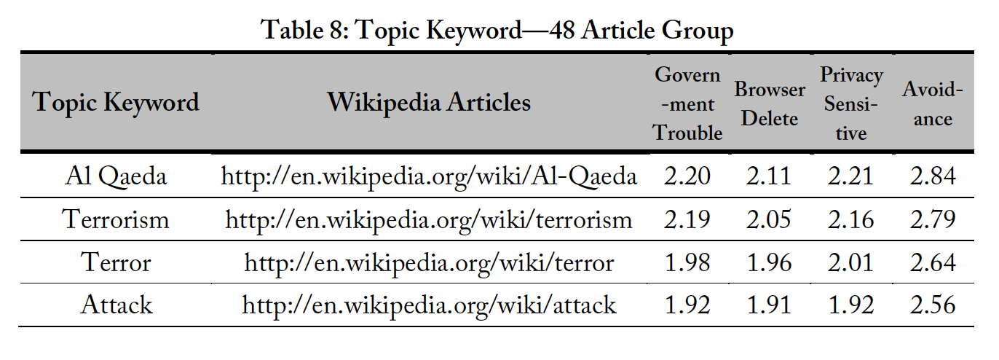


## 2.2 Methodology

The analysis will be done of different set of keywords such as terrism-related article which is expected to change and popular articles which is used as a baseline. The author concludes that there exists a change in trend if coefficients of the interaction terms are significant. Here is the example of regression analysis for terrorism-related articles.

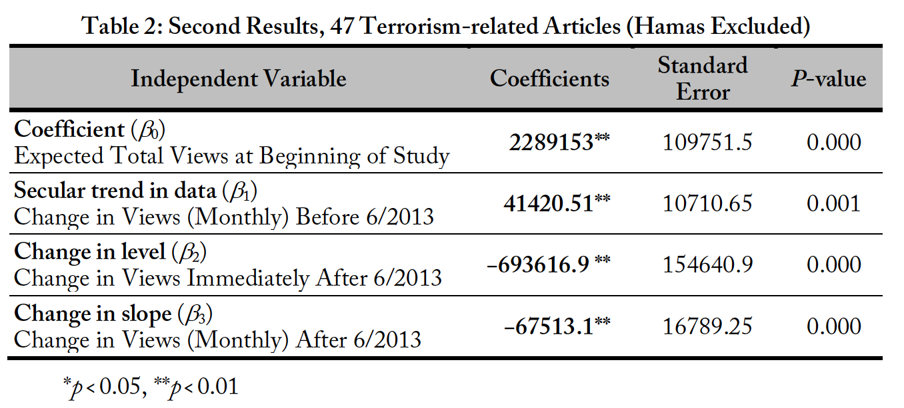

The sample plots will be shown in the Replication Results section to compare with our results.

## 2.3 Criticism

### 2.3.1 Defining and removing outliers

Outliers are treated before performing further analysis in this study. There are two mains type of data that are considered to be outliers. The first reason is unual events, for example the media coverage about dispute between Hamas and Israel. The other method is removing outliers by considering z-score. Both are reasonable way to deal with outliers. However, removing out might cause another problems such as missing data. Moreover, there is no clear rule to identify the events like news and other exposures for all the keywords.

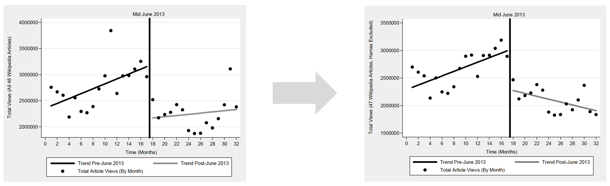

### 2.3.2 Privacy ratings: data collection and calculation

The first problem about data collection is the representation of the population (MTurk, Wikipedia, US Internet users). This issue is acknowledged by the author that the sample of people who did the survey have slightly lower incomes, slightly more male than female and use “websites and other online resources” for information more generally than the overall US population. The use of multiple proxies: Wikipedia as a representation of the internet usage and the opinion of MTurk users as public opinions might make the the result prone to more error.

The second problem about data is how the topics are presented to the subjects. There exists some neutral keywords like ‘recruitment’ and ‘terror’ which their contents in Wikipedia does not related with terrorism. The opinion or privacy rating will be less credible if only the keywords are presented to the subjects not the actual webpage.

Finally, the combined privacy rating is calculate by averaging ‘Government trouble’, ‘Browser delete’, ‘Privacy sensitive’, ‘Avoidance’ assumes that all the factors are equally importance which is difficult to prove the validity.

### 2.3.3 Result interpretation

Theinterpretation of results focus on the significance of coefficients, however it does not provide the sense of magnitude or direction of the change. For example a trend might change for increasing to highly increasing or decreasing and both would give significant results. Moreover, the overall trend might be dominated by few keywords. Our group comes up with the solution to this problem and performs an alternative analysis in the Per-keyword Analysis section.

## 2.4 Replication Results

```{r load data}
load("data/terrorism_data.RData")
load("data/infra_data.RData")
load("data/popular_data.RData")
load("data/terrorism_data_long.RData")
```

### 2.4.1 Total views of terrorism-related keywords before and after the incident

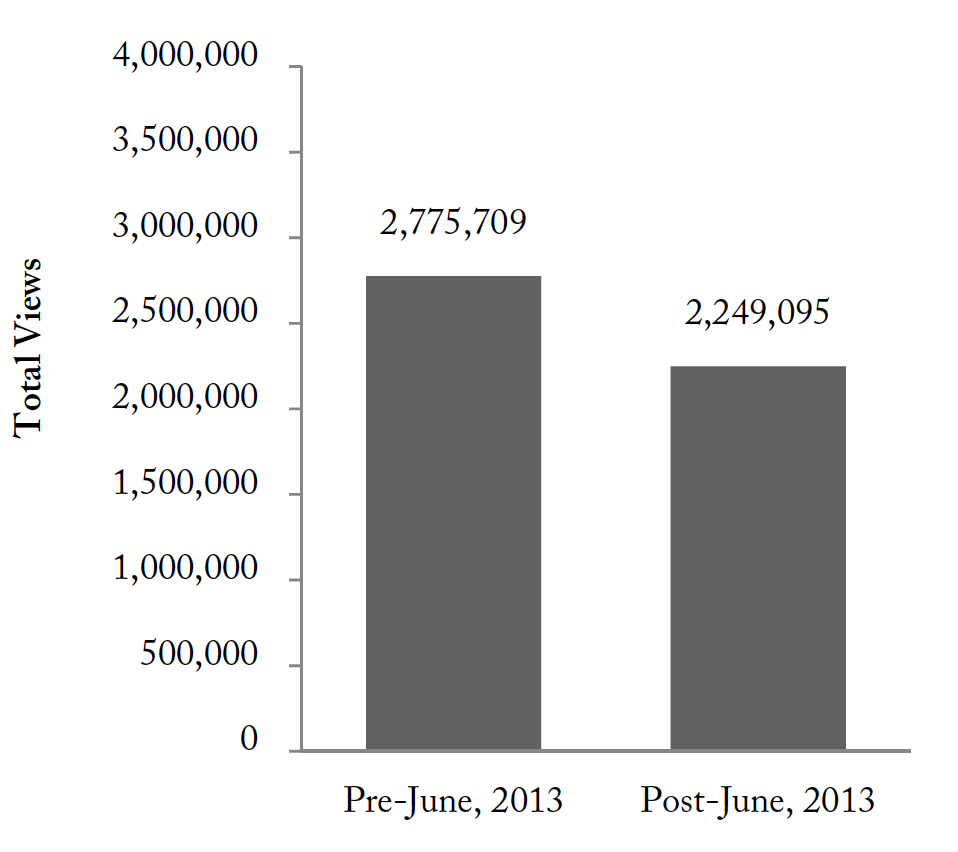

```{r}
terrorism_data %>%
  mutate(before_after = ifelse(date < '2013-06-01', "Before_June_2013", "After_June_2013")) %>%
  group_by(before_after) %>%
  summarise(total_views = sum(views)) %>%
  ggplot(aes(x= factor(before_after, level = c("Before_June_2013", "After_June_2013")), y=total_views, width=0.5)) +
  scale_y_continuous(name="Total Views", labels = comma) +
  xlab("Time") +
  geom_text(aes(label=comma(total_views)), vjust=-0.3, color="black", size=3.5) +
  theme_bw(base_size = 10) +
  geom_bar(stat="identity") +
  ggtitle("Total views of terrorism-related keywords before and after the incident")
```

This plot aims to vaguely prove the simple belief that the behaviors tend to change after the incident indicating 'chilling effect' which can be observed by the decrease of the views on Wikipedia article. Our relplication has the same trend of decreasing volume, however the number are not exactly the same because we count the number of views 1.5 years before and after the incident. Moreover, it is not clear which keywords or if all of traffic is used to produced the original graph. This chart sparks the idea of existence of the effect that will be investigated further in following sections.

### 2.4.2 Linear model with interactions: Analysis and Plots

Based on the linear model with interactions discussed earlier, we decide to implement it on three of the topics, terrorism, infrastructure security, and most popular topics. Our replications include both plots and regression analysis for eaxh topics. Keywords within each topic can be found in the appendix of the paper. We have an assumption that the difference between results are mostly due to the difference in data. We did not perform any treatment to outliers before any analysis since the method is not cleary established.

```{r }
lm_plot_topic <- function(input_df, gg_title){

df <- data.frame(input_df)
df <- df %>% 
  group_by(month=floor_date(date, "month")) %>%
  summarize(views=sum(views))
df$surveillence <- 'before'
df$surveillence[df$month >= '2013-06-01'] <- 'after'

model <- lm(views ~ month + surveillence + month*surveillence, data = df)
print(summary(model))


df$prediction <- predict(model, df)
df$se <- predict(model, df,
                      se.fit = TRUE)$se.fit
z.val <- qnorm(1 - (1 - 0.90)/2)
df$LoCI <- df$prediction - z.val * df$se
df$HiCI <- df$prediction + z.val * df$se

df$month <- ymd(df$month)

ggplot(df,
       aes(x = month,
           y = prediction)) +
  geom_smooth(aes(ymin = LoCI, 
                  ymax = HiCI,
                  color = surveillence),
              stat = "identity") +
  geom_point(data = df, aes(x=month, y = views)) +
  geom_vline(xintercept = as.Date('2013-06-01'), linetype = 2, colour = 'blue') +
  ylab('Views') +
  xlab('Time (monthly)') +
  scale_x_date(date_breaks = "6 month", labels = date_format("%Y-%b")) +
  scale_y_continuous(labels = comma) +
  ggtitle(gg_title)
}
```

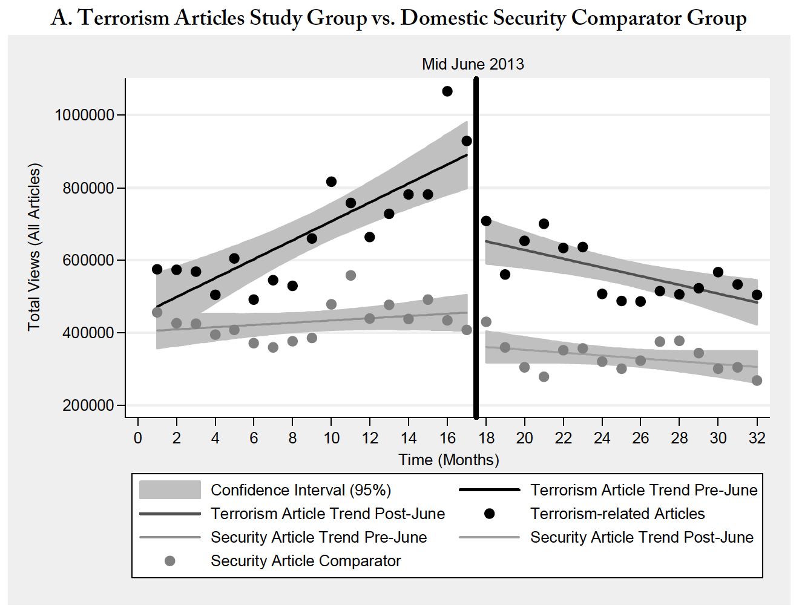

```{r}
lm_plot_topic(terrorism_data, 'Terrorism-related keywords trend before and after June 2013')
```

The result for terrorism-related articles are very similar to the paper.  We got the plot where the trend change from increasing to decreasing and the level is shifted down around 200,000 views. Both coefficients for change in trend and level are significant which is the same as in the original study.

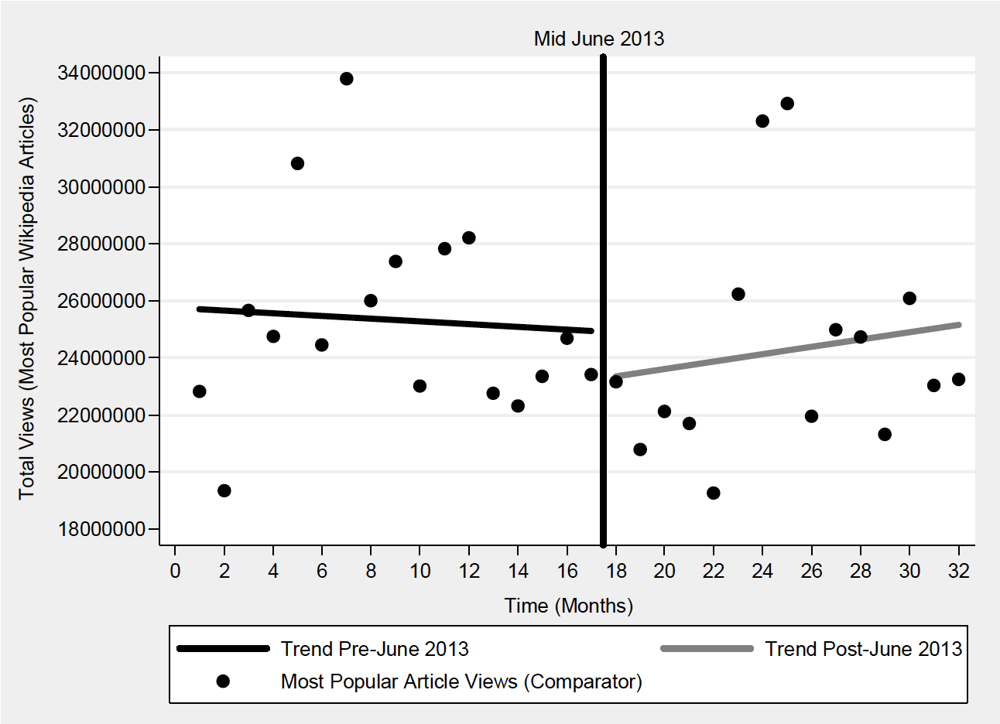

```{r}
lm_plot_topic(popular_data, 'Popular keywords trend before and after June 2013')
```

For most popular articles, our results are quite different from the reference where the trend went slightly down before the event and went up after. Our result is more similar to the terrorism case in term of the trend, but with less change. However, there is almost no shift in level which is same as in the paper. The regression coefficients are significant with lower level, unlike those in the paper which is not significant. However, we would like to mention that the data is quite different both general and outliers.

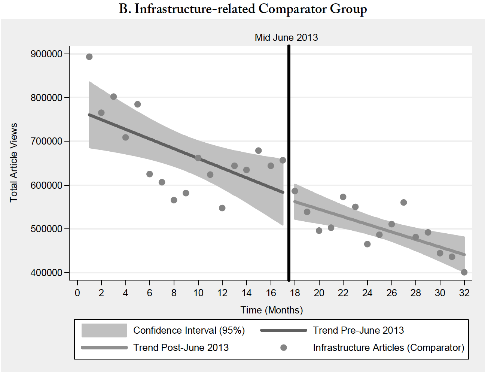

```{r}
lm_plot_topic(infra_data, 'Infrastructure security-related keywords trend before and after June 2013')
```

The result is similar to the paper that the trend keeps going down even after the incident. Our result shows slightly steeper trend which may be caused by the few outliers at July to September 2014. Our regression give the significance for the coefficients while they are not significant in the study.

In summary, the reproduced analysis shows that the results can be reproduced using the same regression model. However, it also points out the importance of the way we deal with outliers which greatly affects the analysis. The difference in data source also causes the discrepancy among results. Finally, it raises an interesting point about coefficients that which can be significant regardless of the change in trend and level. We attempt to quantify the change in section 3.2.

# 3. Extended Analysis

## 3.1 Longer Trend Analysis

The link to our data broke on Saturday May 11th, 2019. Our original plots consisted data from 2012 to 2019. Our group tried to reconstruct the graph from data that was saved on our laptops before the link broke, which is until 2015. Luckly we have original graphs saved as png file. After each reproduced graphs, we included what they used to look like before the link broke, and full data was available. 

```{r}
monthly_agg <- terrorism_data_long %>% 
  group_by(month=floor_date(date, "month")) %>%
  summarize(views=sum(views)) 
monthly_agg$surveillence <- 'before'
monthly_agg$surveillence[monthly_agg$month >= '2013-06-01'] <- 'after'
model <- lm(views ~ month + surveillence + month*surveillence, data = monthly_agg)
summary(model)
monthly_agg$prediction <- predict(model, monthly_agg)
monthly_agg$se <- predict(model, monthly_agg,
                      se.fit = TRUE)$se.fit
z.val <- qnorm(1 - (1 - 0.90)/2)
monthly_agg$LoCI <- monthly_agg$prediction - z.val * monthly_agg$se
monthly_agg$HiCI <- monthly_agg$prediction + z.val * monthly_agg$se
monthly_agg$month <- ymd(monthly_agg$month)
ggplot(monthly_agg,
       aes(x = month,
           y = views)) +
  geom_point(data = monthly_agg, aes(x=month, y = views)) +
  geom_vline(xintercept = as.Date('2013-06-01'), linetype = 2, colour = 'blue') +
  geom_vline(xintercept = as.Date('2014-12-31'), linetype = 2, colour = 'blue') +
  ylab('Views') +
  xlab('Time (monthly)') +
  scale_x_date(date_breaks = "6 month", labels = date_format("%Y-%b")) +
   theme_bw(base_size = 5) +
  scale_y_continuous(labels = comma)
```

First, we take out all the line graphs, and plot scattered graph according to data. 
The original graph with full data is shown above.

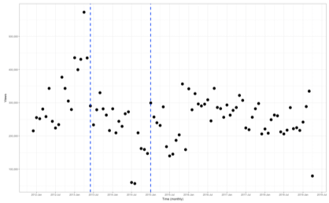


```{r}
monthly_agg <- terrorism_data_long %>% 
  group_by(month=floor_date(date, "month")) %>%
  summarize(views=sum(views)) 
monthly_agg$surveillence <- 'before'
monthly_agg$surveillence[monthly_agg$month >= '2013-06-01'] <- 'after'

model <- lm(views ~ month + surveillence + month*surveillence, data = monthly_agg)
monthly_agg$prediction <- predict(model, monthly_agg)
monthly_agg$se <- predict(model, monthly_agg,
                      se.fit = TRUE)$se.fit
z.val <- qnorm(1 - (1 - 0.90)/2)
monthly_agg$LoCI <- monthly_agg$prediction - z.val * monthly_agg$se
monthly_agg$HiCI <- monthly_agg$prediction + z.val * monthly_agg$se
monthly_agg$month <- ymd(monthly_agg$month)
ggplot(monthly_agg,
       aes(x = month,
           y = views)) + geom_point()+stat_smooth( se=T)+
  geom_point(data = monthly_agg, aes(x=month, y = views)) +
  geom_vline(xintercept = as.Date('2013-06-01'), linetype = 2, colour = 'blue') +
  geom_vline(xintercept = as.Date('2014-12-3'), linetype = 2, colour = 'blue') +
  ylab('Views') +
  xlab('Time (monthly)') +
  scale_x_date(date_breaks = "6 month", labels = date_format("%Y-%b")) +
  theme_bw(base_size = 5) +
  scale_y_continuous(labels = comma)
```

Then, our group had fit a polynomial surface determined by one or more numerical predictors, using local fitting. The graph also displays confidence interval around as gray. The graph below shows rise in trend from 2015 January to July 2016. The graph trend again drops from July 2016 to Jan 2019. The views counts are similar at the beginning of 2016 and end of plot at 2019. This shows that there has been a "trend reovery," but the trend again drops without second "Snowden Revelation." This may mean that the decrease in trend from 2013 to 2015 may be due to other factors rather than due to NSA paranoia.

The original graph with full data is shown below.


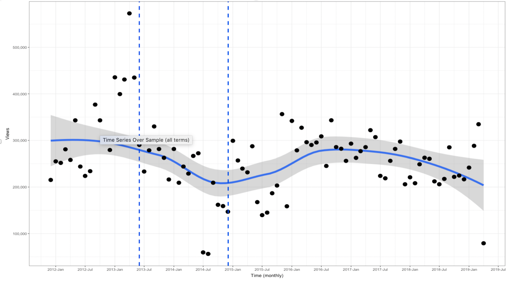

```{r}
monthly_agg <- terrorism_data_long %>% 
  group_by(month=floor_date(date, "month")) %>%
  summarize(views=sum(views)) 
monthly_agg$surveillence <- 'before'
monthly_agg$surveillence[monthly_agg$month >= '2013-06-01'] <- 'after'
model <- lm(views ~ month + surveillence + month*surveillence, data = monthly_agg)
monthly_agg$prediction <- predict(model, monthly_agg)
monthly_agg$se <- predict(model, monthly_agg,
                      se.fit = TRUE)$se.fit
z.val <- qnorm(1 - (1 - 0.90)/2)
monthly_agg$LoCI <- monthly_agg$prediction - z.val * monthly_agg$se
monthly_agg$HiCI <- monthly_agg$prediction + z.val * monthly_agg$se
monthly_agg$month <- ymd(monthly_agg$month)
monthly_agg$month <- as.numeric(monthly_agg$month)
fit <- lm(views~poly(month,4,raw=TRUE),monthly_agg)
plot(views~month,monthly_agg)
curve(predict(fit,newdata=data.frame(month=x)),add=T)

```

Then, our group had went further and fit a polynomial graph of degree 4. The curve above shows that there is sharper decrease in trend at the end of graph, far from 2013 region. This again backs our claim that there is a decrease in 2018 to 2019 without another "Snowden Revelation." This means the decrease in trend after 2013 can be attributed to another resason than Snowden Revelation. 


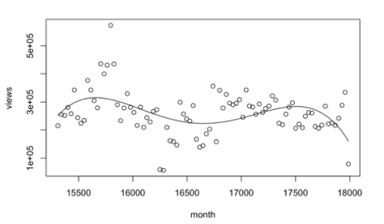

```{r}
monthly_agg <- terrorism_data_long %>% 
  group_by(month=floor_date(date, "month")) %>%
  summarize(views=sum(views)) 
monthly_agg$surveillence <- 'before'
monthly_agg$surveillence[monthly_agg$month >= '2013-06-01'] <- 'after'

model <- lm(views ~ month + surveillence + month*surveillence, data = monthly_agg)
monthly_agg$prediction <- predict(model, monthly_agg)
monthly_agg$se <- predict(model, monthly_agg,
                      se.fit = TRUE)$se.fit
z.val <- qnorm(1 - (1 - 0.90)/2)
monthly_agg$LoCI <- monthly_agg$prediction - z.val * monthly_agg$se
monthly_agg$HiCI <- monthly_agg$prediction + z.val * monthly_agg$se
monthly_agg$month <- ymd(monthly_agg$month)
monthly_agg$month <- as.numeric(monthly_agg$month)
fit <- lm(views~poly(month,5,raw=TRUE),monthly_agg)
plot(views~month,monthly_agg)
curve(predict(fit,newdata=data.frame(month=x)),add=T)
```
Then, our group had went further and fit a polynomial graph of degree 5 instead of 4. This may be overfitting, but wanted to analyze the graph to full extent. This graph also shows that there has been decrease in trend from 2018 to 2019, but end of the trend is actually increasing. This fluctuating trend shows that author of original paper's claim that chilling effect is not caused due to NSA paranoia. 


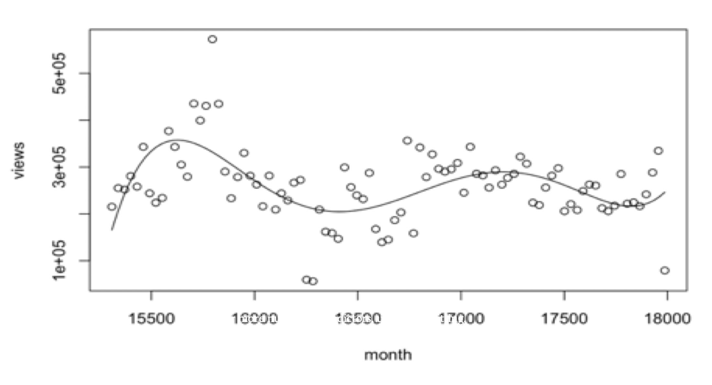

```{r}
monthly_agg <- terrorism_data_long %>% 
  group_by(month=floor_date(date, "month")) %>%
  summarize(views=sum(views)) 
monthly_agg$surveillence <- 'before'
monthly_agg$surveillence[monthly_agg$month >= '2013-06-01'] <- 'after'
monthly_agg$surveillence[monthly_agg$month >= '2014-12-3'] <- 'after_after'
model <- lm(views ~ month + surveillence + month*surveillence, data = monthly_agg)
summary(model)
monthly_agg$prediction <- predict(model, monthly_agg)
monthly_agg$se <- predict(model, monthly_agg,
                      se.fit = TRUE)$se.fit
z.val <- qnorm(1 - (1 - 0.90)/2)
monthly_agg$LoCI <- monthly_agg$prediction - z.val * monthly_agg$se
monthly_agg$HiCI <- monthly_agg$prediction + z.val * monthly_agg$se
monthly_agg$month <- ymd(monthly_agg$month)
ggplot(monthly_agg,
       aes(x = month,
           y = prediction)) +
  geom_smooth(aes(ymin = LoCI, 
                  ymax = HiCI,
                  color = surveillence),
              stat = "identity") +
  geom_point(data = monthly_agg, aes(x=month, y = views)) +
  geom_vline(xintercept = as.Date('2013-06-01'), linetype = 2, colour = 'blue') +
  geom_vline(xintercept = as.Date('2014-12-3'), linetype = 2, colour = 'blue') +
  ylab('Views') +
  xlab('Time (monthly)') +
  scale_x_date(date_breaks = "6 month", labels = date_format("%Y-%b")) +
   theme_bw(base_size = 5) +
  scale_y_continuous(labels = comma)
```

The graph below shows that there is stable trend after January 2015. This graph shows that view after 2015 is higher than from 2013 to 2015. This is only graph that may support author's claim that there had been a trend recovery, and trend stays constant. However, the data is not segmented in equal time bins. This made our group explore further in equal time segmetents of trends after 2015, in the following works below. 


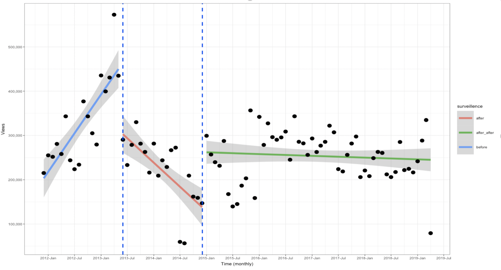


```{r}

monthly_agg <- terrorism_data_long %>% 
  group_by(month=floor_date(date, "month")) %>%
  summarize(views=sum(views)) 
monthly_agg$surveillence <- 'before'
monthly_agg$surveillence[monthly_agg$month >= '2013-06-01'] <- 'after'
monthly_agg$surveillence[monthly_agg$month >= '2014-12-3'] <- 'after_after'
monthly_agg$surveillence[monthly_agg$month >= '2016-06-3'] <- 'after_after_after'
monthly_agg$surveillence[monthly_agg$month >= '2016-06-3'] <- 'after_after_after_after'
model <- lm(views ~ month + surveillence + month*surveillence, data = monthly_agg)
summary(model)
monthly_agg$prediction <- predict(model, monthly_agg)
monthly_agg$se <- predict(model, monthly_agg,
                      se.fit = TRUE)$se.fit
z.val <- qnorm(1 - (1 - 0.90)/2)
monthly_agg$LoCI <- monthly_agg$prediction - z.val * monthly_agg$se
monthly_agg$HiCI <- monthly_agg$prediction + z.val * monthly_agg$se
monthly_agg$month <- ymd(monthly_agg$month)
ggplot(monthly_agg,
       aes(x = month,
           y = prediction)) +
  geom_smooth(aes(ymin = LoCI, 
                  ymax = HiCI,
                  color = surveillence),
              stat = "identity") +
  geom_point(data = monthly_agg, aes(x=month, y = views)) +
  geom_vline(xintercept = as.Date('2013-06-01'), linetype = 2, colour = 'blue') +
  geom_vline(xintercept = as.Date('2014-12-3'), linetype = 2, colour = 'blue') +
  geom_vline(xintercept = as.Date('2016-06-3'), linetype = 2, colour = 'blue') +
  geom_vline(xintercept = as.Date('2016-06-3'), linetype = 2, colour = 'blue') +
  ylab('Views') +
  xlab('Time (monthly)') +
  scale_x_date(date_breaks = "6 month", labels = date_format("%Y-%b")) +
   theme_bw(base_size = 5) +
  scale_y_continuous(labels = comma)
```

Now, our group had seperated the data into equal segments. The graph above shows trend recovery from Jan 2015 to July 2016, trend decrease from July 2016 to Jan 2018, then a stable trend from Jan 2018 to July 2019. This fluctuations may again raise question to paper's author's claim that there exists chilling effect due to Snowden Revelation. 

<p>
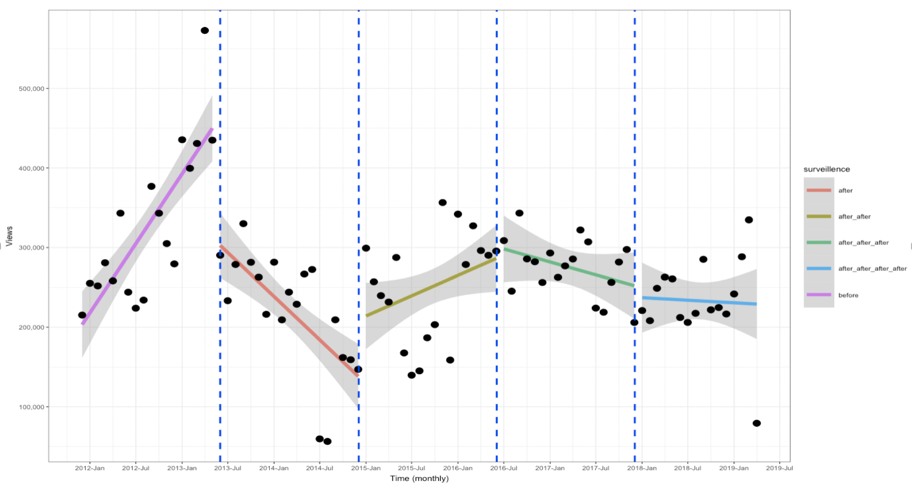
</p>

## 3.2 Per-keyword Analysis

### 3.2.1 Visualizing sample keywords

```{r}
lm_plot_keyword <- function(input_df, article_name, gg_title){

df <- data.frame(input_df)
df <- df %>% 
  group_by(article ,month=floor_date(date, "month")) %>%
  summarize(views=sum(views)) %>%
  filter(article == article_name)  

df$surveillence <- 'before'
df$surveillence[df$month >= '2013-06-01'] <- 'after'

model <- lm(views ~ month + surveillence + month*surveillence, data = df)
print(summary(model))


df$prediction <- predict(model, df)
df$se <- predict(model, df,
                      se.fit = TRUE)$se.fit
z.val <- qnorm(1 - (1 - 0.90)/2)
df$LoCI <- df$prediction - z.val * df$se
df$HiCI <- df$prediction + z.val * df$se

df$month <- ymd(df$month)

ggplot(df,
       aes(x = month,
           y = prediction)) +
  geom_smooth(aes(ymin = LoCI, 
                  ymax = HiCI,
                  color = surveillence),
              stat = "identity") +
  geom_point(data = df, aes(x=month, y = views)) +
  geom_vline(xintercept = as.Date('2013-06-01'), linetype = 2, colour = 'blue') +
  ylab('Views') +
  xlab('Time (monthly)') +
  scale_x_date(date_breaks = "6 month", labels = date_format("%Y-%b")) +
  scale_y_continuous(labels = comma) +
  ggtitle(gg_title)
}
```

```{r}
lm_plot_keyword(terrorism_data, 'al-qaeda', 'Trend for \'al-qaeda\' before and after June 2013')
```

```{r}
lm_plot_keyword(terrorism_data, 'terror', 'Trend for \'terror\' before and after June 2013')
```

```{r}
lm_plot_keyword(terrorism_data, 'recruitment', 'Trend for \'recruitment\' before and after June 2013')
```

### 3.2.2 Quantifying difference between models

```{r}
model_diff <- function(input_df, article_name){

df <- data.frame(input_df)
df <- df %>% 
  group_by(article ,month=floor_date(date, "month")) %>%
  summarize(views=sum(views)) %>%
  filter(article == article_name)  

df$surveillence <- 'before'
df$surveillence[df$month >= '2013-06-01'] <- 'after'

model <- lm(views ~ month + surveillence + month*surveillence, data = df)

interaction_rmse <- sqrt(mean((model$residuals)^2))
int_pred <- predict(model, df %>% filter(surveillence != 'before'))

df2 <- df %>% filter(surveillence == 'before')
model2 <- lm(views ~ month, data = df2)

null_pred <- predict(model2, df %>% filter(surveillence != 'before'))
null_rmse <- sqrt(mean((null_pred - df$views[df$surveillence != 'before'])^2))
return(c(mean((int_pred - null_pred)), interaction_rmse-null_rmse))
}

diff <- c()
diff_rmses <- c()

for(i in unique(terrorism_data$article)){
  res = model_diff(terrorism_data, i)
  diff <- c(diff, res[1])
  diff_rmses <- c(diff_rmses, res[2])
}

diff_results <- data.frame("mean_difference" = diff, "rmse_difference" = diff_rmses)
```

```{r}
ggplot(diff_results, aes(x = rmse_difference)) + 
  geom_histogram(boundary = 0, bins = 20, color = 'grey')
```

The histogram shows

```{r}
ggplot(diff_results, aes(x = mean_difference)) + 
  geom_histogram(boundary = 0, bins = 20, color = 'grey')
```


## 3.3 Time-series Analysis


# 4. Summary

In our longer trend analysis, our group had found that trend fluctuations shown in polynomial  fit graphs (n=4,5) show that there the chilling effect in 2013 may have been caused due to other reasons rather than NSA paranoia. When our group had seperated the data into equal time segments. The graph shows trend recovery from Jan 2015 to July 2016, trend decrease from July 2016 to Jan 2018, then a stable trend from Jan 2018 to July 2019. Again, this fluctuations raise concern to paper's author's claim that there exists chilling effect due to Snowden Revelation. 


The following is a list of all packages used to generate these results. (Leave at very end of file.)

```{r}
sessionInfo()
```