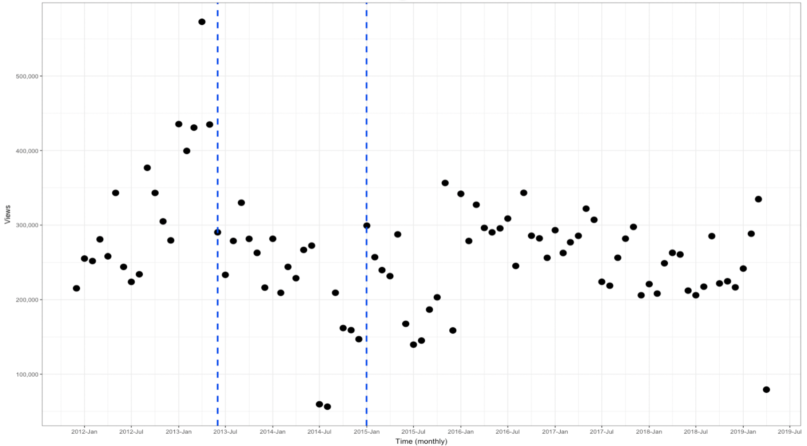
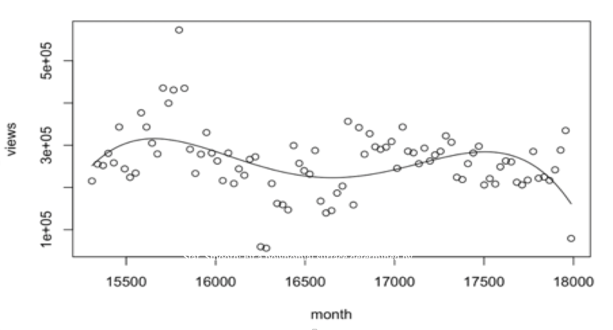

# 1. Introduction

This Rmd file attempts to replicate and extend the results in Chilling Effects: Online Surveillance and Wikipedia Use by Jonathon W. Penney in Berkeley Technology Law Journal. The author is a research fellow at University of Toronto. This single author paper has H5-index of 21. This paper is about the NSA/PRISM surveillance 2007, where United States National Security Agency (NSA) started collecting Internet communications from various US Internet companies. This information was made public in 2013 by Edward Snowden revelations. This paper deals with the NSA paranoia where the paper studies traffic to Wikipedia articles on topics that raise privacy concerns for Wikipedia users before and after the Edward Snowden revelations. The Wikipedia traffic was chosen because over 50% of Internet users use Wikipedia as a source of information. Over 1/3 of Americans annually access Wikipedia as a source of information and is in top 10 of most popular sites on the internet.


```{r setup, include=FALSE}
library(scales)
library(tidyverse)
library(lubridate)
library(wikipediatrend)

library(here)
library(igraph)

theme_set(theme_bw())

knitr::opts_chunk$set(echo = TRUE)
```

# 2. Reproducing the Original Study

```{r load data}
load("data/terrorism_data.RData")
load("data/infra_data.RData")
load("data/popular_data.RData")

load("data/terrorism_data_long.RData")
```

## 2.1 Data

## 2.2 Methodology

## 2.3 Criticism

## 2.4 Replication Results

### 2.4.1 Total views of terrorism-related keywords before and after the incident

```{r}
terrorism_data %>%
  mutate(before_after = ifelse(date < '2013-06-01', "Before_June_2013", "After_June_2013")) %>%
  group_by(before_after) %>%
  summarise(total_views = sum(views)) %>%
  ggplot(aes(x= factor(before_after, level = c("Before_June_2013", "After_June_2013")), y=total_views, width=0.5)) +
  scale_y_continuous(name="Total Views", labels = comma) +
  xlab("Time") +
  geom_text(aes(label=comma(total_views)), vjust=-0.3, color="black", size=3.5) +
  theme_bw(base_size = 10) +
  geom_bar(stat="identity") +
  ggtitle("Total views of terrorism-related keywords before and after the incident")
```

### 2.4.2 Linear model with interactions: Analysis and Plots


```{r }
lm_plot_topic <- function(input_df, gg_title){

df <- data.frame(input_df)
df <- df %>% 
  group_by(month=floor_date(date, "month")) %>%
  summarize(views=sum(views))
df$surveillence <- 'before'
df$surveillence[df$month >= '2013-06-01'] <- 'after'

model <- lm(views ~ month + surveillence + month*surveillence, data = df)
print(summary(model))


df$prediction <- predict(model, df)
df$se <- predict(model, df,
                      se.fit = TRUE)$se.fit
z.val <- qnorm(1 - (1 - 0.90)/2)
df$LoCI <- df$prediction - z.val * df$se
df$HiCI <- df$prediction + z.val * df$se

df$month <- ymd(df$month)

ggplot(df,
       aes(x = month,
           y = prediction)) +
  geom_smooth(aes(ymin = LoCI, 
                  ymax = HiCI,
                  color = surveillence),
              stat = "identity") +
  geom_point(data = df, aes(x=month, y = views)) +
  geom_vline(xintercept = as.Date('2013-06-01'), linetype = 2, colour = 'blue') +
  ylab('Views') +
  xlab('Time (monthly)') +
  scale_x_date(date_breaks = "6 month", labels = date_format("%Y-%b")) +
  scale_y_continuous(labels = comma) +
  ggtitle(gg_title)
}
```


```{r}
lm_plot_topic(terrorism_data, 'Terrorism-related keywords trend before and after June 2013')
```

```{r}
lm_plot_topic(popular_data, 'Popular keywords trend before and after June 2013')
```

```{r}
lm_plot_topic(infra_data, 'Infrastructure security-related keywords trend before and after June 2013')
```

# 3. Extended Analysis

## 3.1 Longer Trend Analysis

The link to our data broke on Saturday May 11th, 2019. Our original plots consisted data from 2012 to 2019. Our group tried to reconstruct the graph from data that was saved on our laptops before the link broke, which is until 2015. Luckly we have original graphs saved as png file. After each reproduced graphs, we included what they used to look like before the link broke, and full data was available. 

```{r}
monthly_agg <- terrorism_data_long %>% 
  group_by(month=floor_date(date, "month")) %>%
  summarize(views=sum(views)) 
monthly_agg$surveillence <- 'before'
monthly_agg$surveillence[monthly_agg$month >= '2013-06-01'] <- 'after'
model <- lm(views ~ month + surveillence + month*surveillence, data = monthly_agg)
summary(model)
monthly_agg$prediction <- predict(model, monthly_agg)
monthly_agg$se <- predict(model, monthly_agg,
                      se.fit = TRUE)$se.fit
z.val <- qnorm(1 - (1 - 0.90)/2)
monthly_agg$LoCI <- monthly_agg$prediction - z.val * monthly_agg$se
monthly_agg$HiCI <- monthly_agg$prediction + z.val * monthly_agg$se
monthly_agg$month <- ymd(monthly_agg$month)
ggplot(monthly_agg,
       aes(x = month,
           y = views)) +
  geom_point(data = monthly_agg, aes(x=month, y = views)) +
  geom_vline(xintercept = as.Date('2013-06-01'), linetype = 2, colour = 'blue') +
  geom_vline(xintercept = as.Date('2014-12-31'), linetype = 2, colour = 'blue') +
  ylab('Views') +
  xlab('Time (monthly)') +
  scale_x_date(date_breaks = "6 month", labels = date_format("%Y-%b")) +
   theme_bw(base_size = 5) +
  scale_y_continuous(labels = comma)
```

First, we take out all the line graphs, and plot scattered graph according to data. 
The original graph with full data is shown above.




```{r}
monthly_agg <- terrorism_data_long %>% 
  group_by(month=floor_date(date, "month")) %>%
  summarize(views=sum(views)) 
monthly_agg$surveillence <- 'before'
monthly_agg$surveillence[monthly_agg$month >= '2013-06-01'] <- 'after'

model <- lm(views ~ month + surveillence + month*surveillence, data = monthly_agg)
monthly_agg$prediction <- predict(model, monthly_agg)
monthly_agg$se <- predict(model, monthly_agg,
                      se.fit = TRUE)$se.fit
z.val <- qnorm(1 - (1 - 0.90)/2)
monthly_agg$LoCI <- monthly_agg$prediction - z.val * monthly_agg$se
monthly_agg$HiCI <- monthly_agg$prediction + z.val * monthly_agg$se
monthly_agg$month <- ymd(monthly_agg$month)
ggplot(monthly_agg,
       aes(x = month,
           y = views)) + geom_point()+stat_smooth( se=T)+
  geom_point(data = monthly_agg, aes(x=month, y = views)) +
  geom_vline(xintercept = as.Date('2013-06-01'), linetype = 2, colour = 'blue') +
  geom_vline(xintercept = as.Date('2014-12-3'), linetype = 2, colour = 'blue') +
  ylab('Views') +
  xlab('Time (monthly)') +
  scale_x_date(date_breaks = "6 month", labels = date_format("%Y-%b")) +
  theme_bw(base_size = 5) +
  scale_y_continuous(labels = comma)
```

Then, our group had fit a polynomial surface determined by one or more numerical predictors, using local fitting. The graph also displays confidence interval around as gray. The graph below shows rise in trend from 2015 January to July 2016. The graph trend again drops from July 2016 to Jan 2019. The views counts are similar at the beginning of 2016 and end of plot at 2019. This shows that there has been a "trend reovery," but the trend again drops without second "Snowden Revelation." This may mean that the decrease in trend from 2013 to 2015 may be due to other factors rather than due to NSA paranoia.

The original graph with full data is shown below.


```{r}
monthly_agg <- terrorism_data_long %>% 
  group_by(month=floor_date(date, "month")) %>%
  summarize(views=sum(views)) 
monthly_agg$surveillence <- 'before'
monthly_agg$surveillence[monthly_agg$month >= '2013-06-01'] <- 'after'
model <- lm(views ~ month + surveillence + month*surveillence, data = monthly_agg)
monthly_agg$prediction <- predict(model, monthly_agg)
monthly_agg$se <- predict(model, monthly_agg,
                      se.fit = TRUE)$se.fit
z.val <- qnorm(1 - (1 - 0.90)/2)
monthly_agg$LoCI <- monthly_agg$prediction - z.val * monthly_agg$se
monthly_agg$HiCI <- monthly_agg$prediction + z.val * monthly_agg$se
monthly_agg$month <- ymd(monthly_agg$month)
monthly_agg$month <- as.numeric(monthly_agg$month)
fit <- lm(views~poly(month,4,raw=TRUE),monthly_agg)
plot(views~month,monthly_agg)
curve(predict(fit,newdata=data.frame(month=x)),add=T)

```

Then, our group had went further and fit a polynomial graph of degree 4. The curve above shows that there is sharper decrease in trend at the end of graph, far from 2013 region. This again backs our claim that there is a decrease in 2018 to 2019 without another "Snowden Revelation." This means the decrease in trend after 2013 can be attributed to another resason than Snowden Revelation. 




```{r}
monthly_agg <- terrorism_data_long %>% 
  group_by(month=floor_date(date, "month")) %>%
  summarize(views=sum(views)) 
monthly_agg$surveillence <- 'before'
monthly_agg$surveillence[monthly_agg$month >= '2013-06-01'] <- 'after'

model <- lm(views ~ month + surveillence + month*surveillence, data = monthly_agg)
monthly_agg$prediction <- predict(model, monthly_agg)
monthly_agg$se <- predict(model, monthly_agg,
                      se.fit = TRUE)$se.fit
z.val <- qnorm(1 - (1 - 0.90)/2)
monthly_agg$LoCI <- monthly_agg$prediction - z.val * monthly_agg$se
monthly_agg$HiCI <- monthly_agg$prediction + z.val * monthly_agg$se
monthly_agg$month <- ymd(monthly_agg$month)
monthly_agg$month <- as.numeric(monthly_agg$month)
fit <- lm(views~poly(month,5,raw=TRUE),monthly_agg)
plot(views~month,monthly_agg)
curve(predict(fit,newdata=data.frame(month=x)),add=T)
```
Then, our group had went further and fit a polynomial graph of degree 5 instead of 4. This may be overfitting, but wanted to analyze the graph to full extent. This graph also shows that there has been decrease in trend from 2018 to 2019, but end of the trend is actually increasing. This fluctuating trend shows that author of original paper's claim that chilling effect is not caused due to NSA paranoia. 


```{r}
monthly_agg <- terrorism_data_long %>% 
  group_by(month=floor_date(date, "month")) %>%
  summarize(views=sum(views)) 
monthly_agg$surveillence <- 'before'
monthly_agg$surveillence[monthly_agg$month >= '2013-06-01'] <- 'after'
monthly_agg$surveillence[monthly_agg$month >= '2014-12-3'] <- 'after_after'
model <- lm(views ~ month + surveillence + month*surveillence, data = monthly_agg)
summary(model)
monthly_agg$prediction <- predict(model, monthly_agg)
monthly_agg$se <- predict(model, monthly_agg,
                      se.fit = TRUE)$se.fit
z.val <- qnorm(1 - (1 - 0.90)/2)
monthly_agg$LoCI <- monthly_agg$prediction - z.val * monthly_agg$se
monthly_agg$HiCI <- monthly_agg$prediction + z.val * monthly_agg$se
monthly_agg$month <- ymd(monthly_agg$month)
ggplot(monthly_agg,
       aes(x = month,
           y = prediction)) +
  geom_smooth(aes(ymin = LoCI, 
                  ymax = HiCI,
                  color = surveillence),
              stat = "identity") +
  geom_point(data = monthly_agg, aes(x=month, y = views)) +
  geom_vline(xintercept = as.Date('2013-06-01'), linetype = 2, colour = 'blue') +
  geom_vline(xintercept = as.Date('2014-12-3'), linetype = 2, colour = 'blue') +
  ylab('Views') +
  xlab('Time (monthly)') +
  scale_x_date(date_breaks = "6 month", labels = date_format("%Y-%b")) +
   theme_bw(base_size = 5) +
  scale_y_continuous(labels = comma)
```

The graph below shows that there is stable trend after January 2015. This graph shows that view after 2015 is higher than from 2013 to 2015. This is only graph that may support author's claim that there had been a trend recovery, and trend stays constant. However, the data is not segmented in equal time bins. This made our group explore further in equal time segmetents of trends after 2015, in the following works below. 


```{r}

monthly_agg <- terrorism_data_long %>% 
  group_by(month=floor_date(date, "month")) %>%
  summarize(views=sum(views)) 
monthly_agg$surveillence <- 'before'
monthly_agg$surveillence[monthly_agg$month >= '2013-06-01'] <- 'after'
monthly_agg$surveillence[monthly_agg$month >= '2014-12-3'] <- 'after_after'
monthly_agg$surveillence[monthly_agg$month >= '2016-06-3'] <- 'after_after_after'
monthly_agg$surveillence[monthly_agg$month >= '2016-06-3'] <- 'after_after_after_after'
model <- lm(views ~ month + surveillence + month*surveillence, data = monthly_agg)
summary(model)
monthly_agg$prediction <- predict(model, monthly_agg)
monthly_agg$se <- predict(model, monthly_agg,
                      se.fit = TRUE)$se.fit
z.val <- qnorm(1 - (1 - 0.90)/2)
monthly_agg$LoCI <- monthly_agg$prediction - z.val * monthly_agg$se
monthly_agg$HiCI <- monthly_agg$prediction + z.val * monthly_agg$se
monthly_agg$month <- ymd(monthly_agg$month)
ggplot(monthly_agg,
       aes(x = month,
           y = prediction)) +
  geom_smooth(aes(ymin = LoCI, 
                  ymax = HiCI,
                  color = surveillence),
              stat = "identity") +
  geom_point(data = monthly_agg, aes(x=month, y = views)) +
  geom_vline(xintercept = as.Date('2013-06-01'), linetype = 2, colour = 'blue') +
  geom_vline(xintercept = as.Date('2014-12-3'), linetype = 2, colour = 'blue') +
  geom_vline(xintercept = as.Date('2016-06-3'), linetype = 2, colour = 'blue') +
  geom_vline(xintercept = as.Date('2016-06-3'), linetype = 2, colour = 'blue') +
  ylab('Views') +
  xlab('Time (monthly)') +
  scale_x_date(date_breaks = "6 month", labels = date_format("%Y-%b")) +
   theme_bw(base_size = 5) +
  scale_y_continuous(labels = comma)
```
Now, our group had seperated the data into equal segments. The graph above shows trend recovery from Jan 2015 to July 2016, trend decrease from July 2016 to Jan 2018, then a stable trend from Jan 2018 to July 2019. This fluctuations may again raise question to paper's author's claim that there exists chilling effect due to Snowden Revelation. 


## 3.2 Per-keyword Analysis

```{r}
lm_plot_keyword <- function(input_df, article_name, gg_title){

df <- data.frame(input_df)
df <- df %>% 
  group_by(article ,month=floor_date(date, "month")) %>%
  summarize(views=sum(views)) %>%
  filter(article == article_name)  

df$surveillence <- 'before'
df$surveillence[df$month >= '2013-06-01'] <- 'after'

model <- lm(views ~ month + surveillence + month*surveillence, data = df)
print(summary(model))


df$prediction <- predict(model, df)
df$se <- predict(model, df,
                      se.fit = TRUE)$se.fit
z.val <- qnorm(1 - (1 - 0.90)/2)
df$LoCI <- df$prediction - z.val * df$se
df$HiCI <- df$prediction + z.val * df$se

df$month <- ymd(df$month)

ggplot(df,
       aes(x = month,
           y = prediction)) +
  geom_smooth(aes(ymin = LoCI, 
                  ymax = HiCI,
                  color = surveillence),
              stat = "identity") +
  geom_point(data = df, aes(x=month, y = views)) +
  geom_vline(xintercept = as.Date('2013-06-01'), linetype = 2, colour = 'blue') +
  ylab('Views') +
  xlab('Time (monthly)') +
  scale_x_date(date_breaks = "6 month", labels = date_format("%Y-%b")) +
  scale_y_continuous(labels = comma) +
  ggtitle(gg_title)
}
```

```{r}
lm_plot_keyword(terrorism_data, 'al-qaeda', 'Trend for \'al-qaeda\' before and after June 2013')
```

```{r}
lm_plot_keyword(terrorism_data, 'terror', 'Trend for \'terror\' before and after June 2013')
```

```{r}
lm_plot_keyword(terrorism_data, 'recruitment', 'Trend for \'recruitment\' before and after June 2013')
```

## 3.3 Time-series Analysis

## 3.4 Trend Recovery

<!-- ```{r , echo=FALSE} -->

<!-- terrorism_topics <- c('Al-Qaeda', 'Terrorism', 'Terror', 'Environmental_terrorism', 'Eco-terrorism', 'Conventional_weapon', 'Weapons-grade', 'Dirty_bomb', 'Nuclear_enrichment', 'nuclear') -->

<!-- trend_data <- -->
<!--   wp_trend( -->
<!--     page = terrorism_topics, -->
<!--     lang = "en", -->
<!--     from = "2011-12-01", -->
<!--     to   = "2015-12-31" -->
<!--   ) -->


<!-- save(trend_data, file = "terrorism_May_11.RData") -->
<!-- #plot(trend_data) -->

<!-- #trend_data %>% -->
<!-- #  group_by(article, month=floor_date(date, "month")) %>% -->
<!-- #  summarize(views=sum(views)) %>% -->
<!-- #  ggplot(aes(x = month, y = views)) + -->
<!-- #  geom_point(aes(color = article)) -->

<!-- monthly_agg <- trend_data %>% -->
<!--   group_by(month=floor_date(date, "month")) %>% -->
<!--   summarize(views=sum(views)) -->
<!-- #%>% -->
<!-- #  ggplot(aes(x = month, y = views)) + -->
<!-- #  geom_point() -->

<!-- monthly_agg$surveillence <- 'before' -->
<!-- monthly_agg$surveillence[monthly_agg$month >= '2013-06-01'] <- 'after' -->

<!-- model <- lm(views ~ month + surveillence + month*surveillence, data = monthly_agg) -->
<!-- summary(model) -->

<!-- #plot(predict(model, monthly_agg)) -->

<!-- monthly_agg$prediction <- predict(model, monthly_agg) -->
<!-- monthly_agg$se <- predict(model, monthly_agg, -->
<!--                       se.fit = TRUE)$se.fit -->
<!-- z.val <- qnorm(1 - (1 - 0.90)/2) -->
<!-- monthly_agg$LoCI <- monthly_agg$prediction - z.val * monthly_agg$se -->
<!-- monthly_agg$HiCI <- monthly_agg$prediction + z.val * monthly_agg$se -->
<!-- #effect_plot(model, pred = view, interval = TRUE, plot.points = TRUE) -->

<!-- monthly_agg$month <- ymd(monthly_agg$month) -->

<!-- ggplot(monthly_agg, -->
<!--        aes(x = month, -->
<!--            y = prediction)) + -->
<!--   geom_smooth(aes(ymin = LoCI, -->
<!--                   ymax = HiCI, -->
<!--                   color = surveillence), -->
<!--               stat = "identity") + -->
<!--   geom_point(data = monthly_agg, aes(x=month, y = views)) + -->
<!--   geom_vline(xintercept = as.Date('2013-06-01'), linetype = 2, colour = 'blue') + -->
<!--   ylab('Views') + -->
<!--   xlab('Time (monthly)') + -->
<!--   scale_x_date(date_breaks = "6 month", labels = date_format("%Y-%b")) + -->
<!--   scale_y_continuous(labels = comma) -->
<!-- ``` -->
<!-- ```{r , echo=FALSE} -->


<!-- terrorism_topics <- c('Al-Qaeda', 'Terrorism', 'Terror', 'Environmental_terrorism', 'Eco-terrorism', 'Conventional_weapon', 'Weapons-grade', 'Dirty_bomb', 'Nuclear_enrichment', 'nuclear') -->

<!-- trend_data <- -->
<!--   wp_trend( -->
<!--     page = terrorism_topics, -->
<!--     lang = "en", -->
<!--     from = "2011-12-01", -->
<!--     to   = "2015-12-31" -->
<!--   ) -->


<!-- trend_data <- -->
<!--   wp_trend( -->
<!--     page = terrorism_topics, -->
<!--     lang = "en", -->
<!--     from = "2011-12-01", -->
<!--     to   = "2019-04-10" -->
<!--   ) -->


<!-- #plot(trend_data) -->

<!-- #trend_data %>% -->
<!-- #  group_by(article, month=floor_date(date, "month")) %>% -->
<!-- #  summarize(views=sum(views)) %>% -->
<!-- #  ggplot(aes(x = month, y = views)) + -->
<!-- #  geom_point(aes(color = article)) -->

<!-- monthly_agg <- trend_data %>% -->
<!--   group_by(month=floor_date(date, "month")) %>% -->
<!--   summarize(views=sum(views)) -->
<!-- #%>% -->
<!-- #  ggplot(aes(x = month, y = views)) + -->
<!-- #  geom_point() -->

<!-- monthly_agg$surveillence <- 'before' -->
<!-- monthly_agg$surveillence[monthly_agg$month >= '2013-06-01'] <- 'after' -->

<!-- model <- lm(views ~ month + surveillence + month*surveillence, data = monthly_agg) -->
<!-- summary(model) -->

<!-- #plot(predict(model, monthly_agg)) -->

<!-- monthly_agg$prediction <- predict(model, monthly_agg) -->
<!-- monthly_agg$se <- predict(model, monthly_agg, -->
<!--                       se.fit = TRUE)$se.fit -->
<!-- z.val <- qnorm(1 - (1 - 0.90)/2) -->
<!-- monthly_agg$LoCI <- monthly_agg$prediction - z.val * monthly_agg$se -->
<!-- monthly_agg$HiCI <- monthly_agg$prediction + z.val * monthly_agg$se -->
<!-- #effect_plot(model, pred = view, interval = TRUE, plot.points = TRUE) -->

<!-- monthly_agg$month <- ymd(monthly_agg$month) -->

<!-- ggplot(monthly_agg, -->
<!--        aes(x = month, -->
<!--            y = prediction)) + -->
<!--   geom_smooth(aes(ymin = LoCI, -->
<!--                   ymax = HiCI, -->
<!--                   color = surveillence), -->
<!--               stat = "identity") + -->
<!--   geom_point(data = monthly_agg, aes(x=month, y = views)) + -->
<!--   geom_vline(xintercept = as.Date('2013-06-01'), linetype = 2, colour = 'blue') + -->
<!--   geom_vline(xintercept = as.Date('2015-12-31'), linetype = 2, colour = 'blue') + -->
<!--   ylab('Views') + -->
<!--   xlab('Time (monthly)') + -->
<!--   scale_x_date(date_breaks = "6 month", labels = date_format("%Y-%b")) + -->
<!--   scale_y_continuous(labels = comma) -->

<!-- ``` -->
<!-- ```{r , echo=FALSE} -->

<!-- terrorism_topics <- c('Al-Qaeda', 'Terrorism', 'Terror', 'Environmental_terrorism', 'Eco-terrorism', 'Conventional_weapon', 'Weapons-grade', 'Dirty_bomb', 'Nuclear_enrichment', 'nuclear') -->

<!-- trend_data <- -->
<!--   wp_trend( -->
<!--     page = terrorism_topics, -->
<!--     lang = "en", -->
<!--     from = "2011-12-01", -->
<!--     to   = "2015-12-31" -->
<!--   ) -->


<!-- trend_data <- -->
<!--   wp_trend( -->
<!--     page = terrorism_topics, -->
<!--     lang = "en", -->
<!--     from = "2011-12-01", -->
<!--     to   = "2019-04-10" -->
<!--   ) -->


<!-- #plot(trend_data) -->

<!-- #trend_data %>% -->
<!-- #  group_by(article, month=floor_date(date, "month")) %>% -->
<!-- #  summarize(views=sum(views)) %>% -->
<!-- #  ggplot(aes(x = month, y = views)) + -->
<!-- #  geom_point(aes(color = article)) -->

<!-- monthly_agg <- trend_data %>% -->
<!--   group_by(month=floor_date(date, "month")) %>% -->
<!--   summarize(views=sum(views)) -->
<!-- #%>% -->
<!-- #  ggplot(aes(x = month, y = views)) + -->
<!-- #  geom_point() -->

<!-- monthly_agg$surveillence <- 'before' -->
<!-- monthly_agg$surveillence[monthly_agg$month >= '2013-06-01'] <- 'after' -->
<!-- monthly_agg$surveillence[monthly_agg$month >= '2014-12-3'] <- 'after_after' -->

<!-- model <- lm(views ~ month + surveillence + month*surveillence, data = monthly_agg) -->
<!-- summary(model) -->

<!-- #plot(predict(model, monthly_agg)) -->

<!-- monthly_agg$prediction <- predict(model, monthly_agg) -->
<!-- monthly_agg$se <- predict(model, monthly_agg, -->
<!--                       se.fit = TRUE)$se.fit -->
<!-- z.val <- qnorm(1 - (1 - 0.90)/2) -->
<!-- monthly_agg$LoCI <- monthly_agg$prediction - z.val * monthly_agg$se -->
<!-- monthly_agg$HiCI <- monthly_agg$prediction + z.val * monthly_agg$se -->
<!-- #effect_plot(model, pred = view, interval = TRUE, plot.points = TRUE) -->

<!-- monthly_agg$month <- ymd(monthly_agg$month) -->

<!-- ggplot(monthly_agg, -->
<!--        aes(x = month, -->
<!--            y = prediction)) + -->
<!--   geom_smooth(aes(ymin = LoCI, -->
<!--                   ymax = HiCI, -->
<!--                   color = surveillence), -->
<!--               stat = "identity") + -->
<!--   geom_point(data = monthly_agg, aes(x=month, y = views)) + -->
<!--   geom_vline(xintercept = as.Date('2013-06-01'), linetype = 2, colour = 'blue') + -->
<!--   geom_vline(xintercept = as.Date('2014-12-3'), linetype = 2, colour = 'blue') + -->
<!--   ylab('Views') + -->
<!--   xlab('Time (monthly)') + -->
<!--   scale_x_date(date_breaks = "6 month", labels = date_format("%Y-%b")) + -->
<!--    theme_bw(base_size = 5) + -->
<!--   scale_y_continuous(labels = comma) -->


<!-- ``` -->


<!-- ```{r , echo=FALSE} -->


<!-- terrorism_topics <- c('Al-Qaeda', 'Terrorism', 'Terror', 'Environmental_terrorism', 'Eco-terrorism', 'Conventional_weapon', 'Weapons-grade', 'Dirty_bomb', 'Nuclear_enrichment', 'nuclear') -->

<!-- trend_data <- -->
<!--   wp_trend( -->
<!--     page = terrorism_topics, -->
<!--     lang = "en", -->
<!--     from = "2011-12-01", -->
<!--     to   = "2015-12-31" -->
<!--   ) -->


<!-- trend_data <- -->
<!--   wp_trend( -->
<!--     page = terrorism_topics, -->
<!--     lang = "en", -->
<!--     from = "2011-12-01", -->
<!--     to   = "2019-04-10" -->
<!--   ) -->


<!-- #plot(trend_data) -->

<!-- #trend_data %>% -->
<!-- #  group_by(article, month=floor_date(date, "month")) %>% -->
<!-- #  summarize(views=sum(views)) %>% -->
<!-- #  ggplot(aes(x = month, y = views)) + -->
<!-- #  geom_point(aes(color = article)) -->

<!-- monthly_agg <- trend_data %>% -->
<!--   group_by(month=floor_date(date, "month")) %>% -->
<!--   summarize(views=sum(views)) -->
<!-- #%>% -->
<!-- #  ggplot(aes(x = month, y = views)) + -->
<!-- #  geom_point() -->

<!-- monthly_agg$surveillence <- 'before' -->
<!-- monthly_agg$surveillence[monthly_agg$month >= '2013-06-01'] <- 'after' -->

<!-- model <- lm(views ~ month + surveillence + month*surveillence, data = monthly_agg) -->
<!-- summary(model) -->

<!-- #plot(predict(model, monthly_agg)) -->

<!-- monthly_agg$prediction <- predict(model, monthly_agg) -->
<!-- monthly_agg$se <- predict(model, monthly_agg, -->
<!--                       se.fit = TRUE)$se.fit -->
<!-- z.val <- qnorm(1 - (1 - 0.90)/2) -->
<!-- monthly_agg$LoCI <- monthly_agg$prediction - z.val * monthly_agg$se -->
<!-- monthly_agg$HiCI <- monthly_agg$prediction + z.val * monthly_agg$se -->
<!-- #effect_plot(model, pred = view, interval = TRUE, plot.points = TRUE) -->

<!-- monthly_agg$month <- ymd(monthly_agg$month) -->

<!-- ggplot(monthly_agg, -->
<!--        aes(x = month, -->
<!--            y = views)) + -->
<!--   geom_smooth(aes(ymin = 0, -->
<!--                   ymax = 0, -->
<!--                   color = surveillence), -->
<!--               stat = "identity") + -->
<!--   geom_point(data = monthly_agg, aes(x=month, y = views)) + -->
<!--   geom_vline(xintercept = as.Date('2013-06-01'), linetype = 2, colour = 'blue') + -->
<!--   geom_vline(xintercept = as.Date('2015-12-31'), linetype = 2, colour = 'blue') + -->
<!--   ylab('Views') + -->
<!--   xlab('Time (monthly)') + -->
<!--   scale_x_date(date_breaks = "6 month", labels = date_format("%Y-%b")) + -->
<!--   scale_y_continuous(labels = comma) -->

<!-- ``` -->


<!-- ```{r , echo=FALSE} -->


<!-- terrorism_topics <- c('Al-Qaeda', 'Terrorism', 'Terror', 'Environmental_terrorism', 'Eco-terrorism', 'Conventional_weapon', 'Weapons-grade', 'Dirty_bomb', 'Nuclear_enrichment', 'nuclear') -->

<!-- trend_data <- -->
<!--   wp_trend( -->
<!--     page = terrorism_topics, -->
<!--     lang = "en", -->
<!--     from = "2011-12-01", -->
<!--     to   = "2015-12-31" -->
<!--   ) -->


<!-- trend_data <- -->
<!--   wp_trend( -->
<!--     page = terrorism_topics, -->
<!--     lang = "en", -->
<!--     from = "2011-12-01", -->
<!--     to   = "2019-04-10" -->
<!--   ) -->


<!-- #plot(trend_data) -->

<!-- #trend_data %>% -->
<!-- #  group_by(article, month=floor_date(date, "month")) %>% -->
<!-- #  summarize(views=sum(views)) %>% -->
<!-- #  ggplot(aes(x = month, y = views)) + -->
<!-- #  geom_point(aes(color = article)) -->

<!-- monthly_agg <- trend_data %>% -->
<!--   group_by(month=floor_date(date, "month")) %>% -->
<!--   summarize(views=sum(views)) -->
<!-- #%>% -->
<!-- #  ggplot(aes(x = month, y = views)) + -->
<!-- #  geom_point() -->

<!-- monthly_agg$surveillence <- 'before' -->
<!-- monthly_agg$surveillence[monthly_agg$month >= '2013-06-01'] <- 'after' -->

<!-- model <- lm(views ~ month + surveillence + month*surveillence, data = monthly_agg) -->
<!-- summary(model) -->

<!-- #plot(predict(model, monthly_agg)) -->

<!-- monthly_agg$prediction <- predict(model, monthly_agg) -->
<!-- monthly_agg$se <- predict(model, monthly_agg, -->
<!--                       se.fit = TRUE)$se.fit -->
<!-- z.val <- qnorm(1 - (1 - 0.90)/2) -->
<!-- monthly_agg$LoCI <- monthly_agg$prediction - z.val * monthly_agg$se -->
<!-- monthly_agg$HiCI <- monthly_agg$prediction + z.val * monthly_agg$se -->
<!-- #effect_plot(model, pred = view, interval = TRUE, plot.points = TRUE) -->

<!-- monthly_agg$month <- ymd(monthly_agg$month) -->

<!-- ggplot(monthly_agg, -->
<!--        aes(x = month, -->
<!--            y = views)) + -->

<!--   geom_point(data = monthly_agg, aes(x=month, y = views)) + -->
<!--   geom_vline(xintercept = as.Date('2013-06-01'), linetype = 2, colour = 'blue') + -->
<!--   geom_vline(xintercept = as.Date('2014-12-31'), linetype = 2, colour = 'blue') + -->
<!--   ylab('Views') + -->
<!--   xlab('Time (monthly)') + -->
<!--   scale_x_date(date_breaks = "6 month", labels = date_format("%Y-%b")) + -->
<!--    theme_bw(base_size = 5) + -->
<!--   scale_y_continuous(labels = comma) -->

<!-- ``` -->


<!-- ```{r , echo=FALSE} -->


<!-- terrorism_topics <- c('Al-Qaeda', 'Terrorism', 'Terror', 'Environmental_terrorism', 'Eco-terrorism', 'Conventional_weapon', 'Weapons-grade', 'Dirty_bomb', 'Nuclear_enrichment', 'nuclear') -->

<!-- trend_data <- -->
<!--   wp_trend( -->
<!--     page = terrorism_topics, -->
<!--     lang = "en", -->
<!--     from = "2011-12-01", -->
<!--     to   = "2015-12-31" -->
<!--   ) -->


<!-- trend_data <- -->
<!--   wp_trend( -->
<!--     page = terrorism_topics, -->
<!--     lang = "en", -->
<!--     from = "2011-12-01", -->
<!--     to   = "2019-04-10" -->
<!--   ) -->


<!-- #plot(trend_data) -->

<!-- #trend_data %>% -->
<!-- #  group_by(article, month=floor_date(date, "month")) %>% -->
<!-- #  summarize(views=sum(views)) %>% -->
<!-- #  ggplot(aes(x = month, y = views)) + -->
<!-- #  geom_point(aes(color = article)) -->

<!-- monthly_agg <- trend_data %>% -->
<!--   group_by(month=floor_date(date, "month")) %>% -->
<!--   summarize(views=sum(views)) -->
<!-- #%>% -->
<!-- #  ggplot(aes(x = month, y = views)) + -->
<!-- #  geom_point() -->

<!-- monthly_agg$surveillence <- 'before' -->
<!-- monthly_agg$surveillence[monthly_agg$month >= '2013-06-01'] <- 'after' -->

<!-- model <- lm(views ~ month + surveillence + month*surveillence, data = monthly_agg) -->


<!-- #plot(predict(model, monthly_agg)) -->

<!-- monthly_agg$prediction <- predict(model, monthly_agg) -->
<!-- monthly_agg$se <- predict(model, monthly_agg, -->
<!--                       se.fit = TRUE)$se.fit -->
<!-- z.val <- qnorm(1 - (1 - 0.90)/2) -->
<!-- monthly_agg$LoCI <- monthly_agg$prediction - z.val * monthly_agg$se -->
<!-- monthly_agg$HiCI <- monthly_agg$prediction + z.val * monthly_agg$se -->
<!-- #effect_plot(model, pred = view, interval = TRUE, plot.points = TRUE) -->

<!-- monthly_agg$month <- ymd(monthly_agg$month) -->


<!-- #fit <- lm(views ~ month + I(month^2), data = monthly_agg) -->

<!-- #plot(views~month) -->
<!-- #points(month, fitted(fit), col='red', pch=20) -->

<!-- ggplot(monthly_agg, -->
<!--        aes(x = month, -->
<!--            y = views)) + geom_point()+stat_smooth(se=T)+ -->

<!--   geom_point(data = monthly_agg, aes(x=month, y = views)) + -->
<!--   geom_vline(xintercept = as.Date('2013-06-01'), linetype = 2, colour = 'blue') + -->
<!--   geom_vline(xintercept = as.Date('2015-12-31'), linetype = 2, colour = 'blue') + -->
<!--   ylab('Views') + -->
<!--   xlab('Time (monthly)') + -->
<!--   scale_x_date(date_breaks = "6 month", labels = date_format("%Y-%b")) + -->
<!--   scale_y_continuous(labels = comma) -->


<!-- ``` -->


<!-- ```{r , echo=FALSE} -->


<!-- terrorism_topics <- c('Al-Qaeda', 'Terrorism', 'Terror', 'Environmental_terrorism', 'Eco-terrorism', 'Conventional_weapon', 'Weapons-grade', 'Dirty_bomb', 'Nuclear_enrichment', 'nuclear') -->

<!-- trend_data <- -->
<!--   wp_trend( -->
<!--     page = terrorism_topics, -->
<!--     lang = "en", -->
<!--     from = "2011-12-01", -->
<!--     to   = "2015-12-31" -->
<!--   ) -->


<!-- trend_data <- -->
<!--   wp_trend( -->
<!--     page = terrorism_topics, -->
<!--     lang = "en", -->
<!--     from = "2011-12-01", -->
<!--     to   = "2019-04-10" -->
<!--   ) -->


<!-- #plot(trend_data) -->

<!-- #trend_data %>% -->
<!-- #  group_by(article, month=floor_date(date, "month")) %>% -->
<!-- #  summarize(views=sum(views)) %>% -->
<!-- #  ggplot(aes(x = month, y = views)) + -->
<!-- #  geom_point(aes(color = article)) -->

<!-- monthly_agg <- trend_data %>% -->
<!--   group_by(month=floor_date(date, "month")) %>% -->
<!--   summarize(views=sum(views)) -->
<!-- #%>% -->
<!-- #  ggplot(aes(x = month, y = views)) + -->
<!-- #  geom_point() -->

<!-- monthly_agg$surveillence <- 'before' -->
<!-- monthly_agg$surveillence[monthly_agg$month >= '2013-06-01'] <- 'after' -->

<!-- model <- lm(views ~ month + surveillence + month*surveillence, data = monthly_agg) -->


<!-- #plot(predict(model, monthly_agg)) -->

<!-- monthly_agg$prediction <- predict(model, monthly_agg) -->
<!-- monthly_agg$se <- predict(model, monthly_agg, -->
<!--                       se.fit = TRUE)$se.fit -->
<!-- z.val <- qnorm(1 - (1 - 0.90)/2) -->
<!-- monthly_agg$LoCI <- monthly_agg$prediction - z.val * monthly_agg$se -->
<!-- monthly_agg$HiCI <- monthly_agg$prediction + z.val * monthly_agg$se -->
<!-- #effect_plot(model, pred = view, interval = TRUE, plot.points = TRUE) -->

<!-- monthly_agg$month <- ymd(monthly_agg$month) -->


<!-- #fit <- lm(views ~ month + I(month^2), data = monthly_agg) -->

<!-- #plot(views~month) -->
<!-- #points(month, fitted(fit), col='red', pch=20) -->

<!-- ggplot(monthly_agg, -->
<!--        aes(x = month, -->
<!--            y = views)) + geom_point()+stat_smooth(method="loess", se=F)+ -->

<!--   geom_point(data = monthly_agg, aes(x=month, y = views)) + -->
<!--   geom_vline(xintercept = as.Date('2013-06-01'), linetype = 2, colour = 'blue') + -->
<!--   geom_vline(xintercept = as.Date('2015-12-31'), linetype = 2, colour = 'blue') + -->
<!--   ylab('Views') + -->
<!--   xlab('Time (monthly)') + -->
<!--   scale_x_date(date_breaks = "6 month", labels = date_format("%Y-%b")) + -->
<!--   scale_y_continuous(labels = comma) -->


<!-- ``` -->


<!-- ```{r , echo=FALSE} -->


<!-- terrorism_topics <- c('Al-Qaeda', 'Terrorism', 'Terror', 'Environmental_terrorism', 'Eco-terrorism', 'Conventional_weapon', 'Weapons-grade', 'Dirty_bomb', 'Nuclear_enrichment', 'nuclear') -->

<!-- trend_data <- -->
<!--   wp_trend( -->
<!--     page = terrorism_topics, -->
<!--     lang = "en", -->
<!--     from = "2011-12-01", -->
<!--     to   = "2015-12-31" -->
<!--   ) -->


<!-- trend_data <- -->
<!--   wp_trend( -->
<!--     page = terrorism_topics, -->
<!--     lang = "en", -->
<!--     from = "2011-12-01", -->
<!--     to   = "2019-04-10" -->
<!--   ) -->


<!-- #plot(trend_data) -->

<!-- #trend_data %>% -->
<!-- #  group_by(article, month=floor_date(date, "month")) %>% -->
<!-- #  summarize(views=sum(views)) %>% -->
<!-- #  ggplot(aes(x = month, y = views)) + -->
<!-- #  geom_point(aes(color = article)) -->

<!-- monthly_agg <- trend_data %>% -->
<!--   group_by(month=floor_date(date, "month")) %>% -->
<!--   summarize(views=sum(views)) -->
<!-- #%>% -->
<!-- #  ggplot(aes(x = month, y = views)) + -->
<!-- #  geom_point() -->

<!-- monthly_agg$surveillence <- 'before' -->
<!-- monthly_agg$surveillence[monthly_agg$month >= '2013-06-01'] <- 'after' -->

<!-- model <- lm(views ~ month + surveillence + month*surveillence, data = monthly_agg) -->


<!-- #plot(predict(model, monthly_agg)) -->

<!-- monthly_agg$prediction <- predict(model, monthly_agg) -->
<!-- monthly_agg$se <- predict(model, monthly_agg, -->
<!--                       se.fit = TRUE)$se.fit -->
<!-- z.val <- qnorm(1 - (1 - 0.90)/2) -->
<!-- monthly_agg$LoCI <- monthly_agg$prediction - z.val * monthly_agg$se -->
<!-- monthly_agg$HiCI <- monthly_agg$prediction + z.val * monthly_agg$se -->
<!-- #effect_plot(model, pred = view, interval = TRUE, plot.points = TRUE) -->

<!-- monthly_agg$month <- ymd(monthly_agg$month) -->


<!-- #fit <- lm(views ~ month + I(month^2), data = monthly_agg) -->

<!-- #plot(views~month) -->
<!-- #points(month, fitted(fit), col='red', pch=20) -->
<!-- monthly_agg$month <- as.numeric(monthly_agg$month) -->
<!-- fit <- lm(views~poly(month,5,raw=TRUE),monthly_agg) -->
<!-- plot(views~month,monthly_agg) -->
<!-- curve(predict(fit,newdata=data.frame(month=x)),add=T) -->
<!-- ``` -->


<!-- ```{r , echo=FALSE} -->


<!-- terrorism_topics <- c('Al-Qaeda', 'Terrorism', 'Terror', 'Environmental_terrorism', 'Eco-terrorism', 'Conventional_weapon', 'Weapons-grade', 'Dirty_bomb', 'Nuclear_enrichment', 'nuclear') -->

<!-- trend_data <- -->
<!--   wp_trend( -->
<!--     page = terrorism_topics, -->
<!--     lang = "en", -->
<!--     from = "2011-12-01", -->
<!--     to   = "2015-12-31" -->
<!--   ) -->


<!-- trend_data <- -->
<!--   wp_trend( -->
<!--     page = terrorism_topics, -->
<!--     lang = "en", -->
<!--     from = "2011-12-01", -->
<!--     to   = "2019-04-10" -->
<!--   ) -->


<!-- #plot(trend_data) -->

<!-- #trend_data %>% -->
<!-- #  group_by(article, month=floor_date(date, "month")) %>% -->
<!-- #  summarize(views=sum(views)) %>% -->
<!-- #  ggplot(aes(x = month, y = views)) + -->
<!-- #  geom_point(aes(color = article)) -->

<!-- monthly_agg <- trend_data %>% -->
<!--   group_by(month=floor_date(date, "month")) %>% -->
<!--   summarize(views=sum(views)) -->
<!-- #%>% -->
<!-- #  ggplot(aes(x = month, y = views)) + -->
<!-- #  geom_point() -->

<!-- monthly_agg$surveillence <- 'before' -->
<!-- monthly_agg$surveillence[monthly_agg$month >= '2013-06-01'] <- 'after' -->

<!-- model <- lm(views ~ month + surveillence + month*surveillence, data = monthly_agg) -->


<!-- #plot(predict(model, monthly_agg)) -->

<!-- monthly_agg$prediction <- predict(model, monthly_agg) -->
<!-- monthly_agg$se <- predict(model, monthly_agg, -->
<!--                       se.fit = TRUE)$se.fit -->
<!-- z.val <- qnorm(1 - (1 - 0.90)/2) -->
<!-- monthly_agg$LoCI <- monthly_agg$prediction - z.val * monthly_agg$se -->
<!-- monthly_agg$HiCI <- monthly_agg$prediction + z.val * monthly_agg$se -->
<!-- #effect_plot(model, pred = view, interval = TRUE, plot.points = TRUE) -->

<!-- monthly_agg$month <- ymd(monthly_agg$month) -->


<!-- #fit <- lm(views ~ month + I(month^2), data = monthly_agg) -->

<!-- #plot(views~month) -->
<!-- #points(month, fitted(fit), col='red', pch=20) -->

<!-- ggplot(monthly_agg, -->
<!--        aes(x = month, -->
<!--            y = views)) + geom_point()+stat_smooth( se=T)+ -->

<!--   geom_point(data = monthly_agg, aes(x=month, y = views)) + -->
<!--   geom_vline(xintercept = as.Date('2013-06-01'), linetype = 2, colour = 'blue') + -->
<!--   geom_vline(xintercept = as.Date('2014-12-3'), linetype = 2, colour = 'blue') + -->
<!--   ylab('Views') + -->
<!--   xlab('Time (monthly)') + -->
<!--   scale_x_date(date_breaks = "6 month", labels = date_format("%Y-%b")) + -->
<!--   theme_bw(base_size = 5) + -->
<!--   scale_y_continuous(labels = comma) -->


<!-- ``` -->


<!-- ```{r , echo=FALSE} -->


<!-- terrorism_topics <- c('Al-Qaeda', 'Terrorism', 'Terror', 'Environmental_terrorism', 'Eco-terrorism', 'Conventional_weapon', 'Weapons-grade', 'Dirty_bomb', 'Nuclear_enrichment', 'nuclear') -->

<!-- trend_data <- -->
<!--   wp_trend( -->
<!--     page = terrorism_topics, -->
<!--     lang = "en", -->
<!--     from = "2011-12-01", -->
<!--     to   = "2015-12-31" -->
<!--   ) -->


<!-- trend_data <- -->
<!--   wp_trend( -->
<!--     page = terrorism_topics, -->
<!--     lang = "en", -->
<!--     from = "2011-12-01", -->
<!--     to   = "2019-04-10" -->
<!--   ) -->


<!-- #plot(trend_data) -->

<!-- #trend_data %>% -->
<!-- #  group_by(article, month=floor_date(date, "month")) %>% -->
<!-- #  summarize(views=sum(views)) %>% -->
<!-- #  ggplot(aes(x = month, y = views)) + -->
<!-- #  geom_point(aes(color = article)) -->

<!-- monthly_agg <- trend_data %>% -->
<!--   group_by(month=floor_date(date, "month")) %>% -->
<!--   summarize(views=sum(views)) -->
<!-- #%>% -->
<!-- #  ggplot(aes(x = month, y = views)) + -->
<!-- #  geom_point() -->

<!-- monthly_agg$surveillence <- 'before' -->
<!-- monthly_agg$surveillence[monthly_agg$month >= '2013-06-01'] <- 'after' -->

<!-- model <- lm(views ~ month + surveillence + month*surveillence, data = monthly_agg) -->


<!-- #plot(predict(model, monthly_agg)) -->

<!-- monthly_agg$prediction <- predict(model, monthly_agg) -->
<!-- monthly_agg$se <- predict(model, monthly_agg, -->
<!--                       se.fit = TRUE)$se.fit -->
<!-- z.val <- qnorm(1 - (1 - 0.90)/2) -->
<!-- monthly_agg$LoCI <- monthly_agg$prediction - z.val * monthly_agg$se -->
<!-- monthly_agg$HiCI <- monthly_agg$prediction + z.val * monthly_agg$se -->
<!-- #effect_plot(model, pred = view, interval = TRUE, plot.points = TRUE) -->

<!-- monthly_agg$month <- ymd(monthly_agg$month) -->


<!-- #fit <- lm(views ~ month + I(month^2), data = monthly_agg) -->

<!-- #plot(views~month) -->
<!-- #points(month, fitted(fit), col='red', pch=20) -->
<!-- monthly_agg$month <- as.numeric(monthly_agg$month) -->
<!-- fit <- lm(views~poly(month,5,raw=TRUE),monthly_agg) -->
<!-- plot(views~month,monthly_agg) -->
<!-- curve(predict(fit,newdata=data.frame(month=x)),add=T) -->
<!-- ``` -->


<!-- ```{r , echo=FALSE} -->

<!-- terrorism_topics <- c('Al-Qaeda', 'Terrorism', 'Terror', 'Environmental_terrorism', 'Eco-terrorism', 'Conventional_weapon', 'Weapons-grade', 'Dirty_bomb', 'Nuclear_enrichment', 'nuclear') -->

<!-- trend_data <- -->
<!--   wp_trend( -->
<!--     page = terrorism_topics, -->
<!--     lang = "en", -->
<!--     from = "2011-12-01", -->
<!--     to   = "2014-12-3" -->
<!--   ) -->

<!-- #plot(trend_data) -->

<!-- #trend_data %>% -->
<!-- #  group_by(article, month=floor_date(date, "month")) %>% -->
<!-- #  summarize(views=sum(views)) %>% -->
<!-- #  ggplot(aes(x = month, y = views)) + -->
<!-- #  geom_point(aes(color = article)) -->

<!-- monthly_agg <- trend_data %>% -->
<!--   group_by(month=floor_date(date, "month")) %>% -->
<!--   summarize(views=sum(views)) -->
<!-- #%>% -->
<!-- #  ggplot(aes(x = month, y = views)) + -->
<!-- #  geom_point() -->

<!-- monthly_agg$surveillence <- 'before' -->
<!-- monthly_agg$surveillence[monthly_agg$month >= '2013-06-01'] <- 'after' -->

<!-- model <- lm(views ~ month + surveillence + month*surveillence, data = monthly_agg) -->
<!-- summary(model) -->

<!-- #plot(predict(model, monthly_agg)) -->

<!-- monthly_agg$prediction <- predict(model, monthly_agg) -->
<!-- monthly_agg$se <- predict(model, monthly_agg, -->
<!--                       se.fit = TRUE)$se.fit -->
<!-- z.val <- qnorm(1 - (1 - 0.90)/2) -->
<!-- monthly_agg$LoCI <- monthly_agg$prediction - z.val * monthly_agg$se -->
<!-- monthly_agg$HiCI <- monthly_agg$prediction + z.val * monthly_agg$se -->
<!-- #effect_plot(model, pred = view, interval = TRUE, plot.points = TRUE) -->

<!-- monthly_agg$month <- ymd(monthly_agg$month) -->

<!-- plot_before <- monthly_agg$views[monthly_agg$month < '2013-06-01'] -->
<!-- plot_after <- monthly_agg$views[monthly_agg$month >= '2013-06-01'] -->

<!-- plot_before <- sum(plot_before) -->
<!-- plot_after <- sum(plot_after) -->

<!-- df <- data.frame(Date1=c("After_June_2013", "Before_June_2013"), -->
<!--                 Total_Views=c(plot_after, plot_before)) -->
<!-- df$Date <- factor(df$Date1, c("Before_June_2013", "After_June_2013")) -->
<!-- ggplot(data=df, aes(x=Date, y=Total_Views, width=0.2)) + -->
<!--   scale_y_continuous(name="Total Views", labels = comma) + -->
<!--   theme_bw(base_size = 10) + -->
<!--   geom_bar(stat="identity") -->


<!-- ``` -->


<!-- ```{r , echo=FALSE} -->

<!-- terrorism_topics <- c('Al-Qaeda', 'Terrorism', 'Terror', 'Environmental_terrorism', 'Eco-terrorism', 'Conventional_weapon', 'Weapons-grade', 'Dirty_bomb', 'Nuclear_enrichment', 'nuclear') -->

<!-- trend_data <- -->
<!--   wp_trend( -->
<!--     page = terrorism_topics, -->
<!--     lang = "en", -->
<!--     from = "2011-12-01", -->
<!--     to   = "2015-12-31" -->
<!--   ) -->


<!-- trend_data <- -->
<!--   wp_trend( -->
<!--     page = terrorism_topics, -->
<!--     lang = "en", -->
<!--     from = "2011-12-01", -->
<!--     to   = "2019-04-10" -->
<!--   ) -->


<!-- #plot(trend_data) -->

<!-- #trend_data %>% -->
<!-- #  group_by(article, month=floor_date(date, "month")) %>% -->
<!-- #  summarize(views=sum(views)) %>% -->
<!-- #  ggplot(aes(x = month, y = views)) + -->
<!-- #  geom_point(aes(color = article)) -->

<!-- monthly_agg <- trend_data %>% -->
<!--   group_by(month=floor_date(date, "month")) %>% -->
<!--   summarize(views=sum(views)) -->
<!-- #%>% -->
<!-- #  ggplot(aes(x = month, y = views)) + -->
<!-- #  geom_point() -->

<!-- monthly_agg$surveillence <- 'before' -->
<!-- monthly_agg$surveillence[monthly_agg$month >= '2013-06-01'] <- 'after' -->
<!-- monthly_agg$surveillence[monthly_agg$month >= '2014-12-3'] <- 'after_after' -->
<!-- monthly_agg$surveillence[monthly_agg$month >= '2016-06-3'] <- 'after_after_after' -->
<!-- monthly_agg$surveillence[monthly_agg$month >= '2016-06-3'] <- 'after_after_after_after' -->

<!-- model <- lm(views ~ month + surveillence + month*surveillence, data = monthly_agg) -->
<!-- summary(model) -->

<!-- #plot(predict(model, monthly_agg)) -->

<!-- monthly_agg$prediction <- predict(model, monthly_agg) -->
<!-- monthly_agg$se <- predict(model, monthly_agg, -->
<!--                       se.fit = TRUE)$se.fit -->
<!-- z.val <- qnorm(1 - (1 - 0.90)/2) -->
<!-- monthly_agg$LoCI <- monthly_agg$prediction - z.val * monthly_agg$se -->
<!-- monthly_agg$HiCI <- monthly_agg$prediction + z.val * monthly_agg$se -->
<!-- #effect_plot(model, pred = view, interval = TRUE, plot.points = TRUE) -->

<!-- monthly_agg$month <- ymd(monthly_agg$month) -->

<!-- ggplot(monthly_agg, -->
<!--        aes(x = month, -->
<!--            y = prediction)) + -->
<!--   geom_smooth(aes(ymin = LoCI, -->
<!--                   ymax = HiCI, -->
<!--                   color = surveillence), -->
<!--               stat = "identity") + -->
<!--   geom_point(data = monthly_agg, aes(x=month, y = views)) + -->
<!--   geom_vline(xintercept = as.Date('2013-06-01'), linetype = 2, colour = 'blue') + -->
<!--   geom_vline(xintercept = as.Date('2014-12-3'), linetype = 2, colour = 'blue') + -->
<!--   geom_vline(xintercept = as.Date('2016-06-3'), linetype = 2, colour = 'blue') + -->
<!--   geom_vline(xintercept = as.Date('2016-06-3'), linetype = 2, colour = 'blue') + -->
<!--   ylab('Views') + -->
<!--   xlab('Time (monthly)') + -->
<!--   scale_x_date(date_breaks = "6 month", labels = date_format("%Y-%b")) + -->
<!--    theme_bw(base_size = 5) + -->
<!--   scale_y_continuous(labels = comma) -->


<!-- ``` -->


# 4. Summary

In our longer trend analysis, our group had found that trend fluctuations shown in polynomial  fit graphs (n=4,5) show that there the chilling effect in 2013 may have been caused due to other reasons rather than NSA paranoia. When our group had seperated the data into equal time segments. The graph shows trend recovery from Jan 2015 to July 2016, trend decrease from July 2016 to Jan 2018, then a stable trend from Jan 2018 to July 2019. Again, this fluctuations raise concern to paper's author's claim that there exists chilling effect due to Snowden Revelation. 


The following is a list of all packages used to generate these results. (Leave at very end of file.)

```{r}
sessionInfo()
```